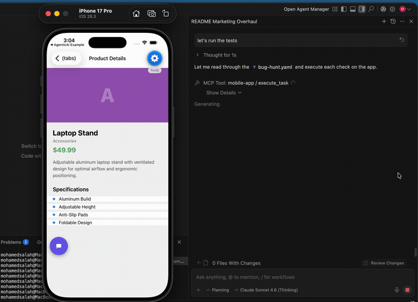

# MobileAI — AI Agent SDK for React Native

> **Ship an AI agent inside your React Native app — with one component.** The AI sees your live UI, acts on it by natural language, and speaks back in real time. No selectors. No wrappers. No screenshots.

### 🤖 AI Agent — Autonomous UI Control

<p align="center">
  
</p>

### 🧪 AI-Powered Testing — Your AI Editor Tests Your App

<p align="center">
  
</p>

> *Google Antigravity autonomously finding bugs in the example app — no test code written, no selectors, just English.*

---

**Two names, one package:**

| | Package | npm |
|---|---|---|
| 📦 | `@mobileai/react-native` | [](https://www.npmjs.com/package/@mobileai/react-native) |
| 📦 | `react-native-agentic-ai` | [](https://www.npmjs.com/package/react-native-agentic-ai) |

[](https://github.com/mohamed2m2018/mobileai-react-native/blob/main/LICENSE)
[]()
[](https://github.com/mohamed2m2018/react-native-agentic-ai)

```bash
npm install @mobileai/react-native
```

> ⭐ If this helped you, [star this repo](https://github.com/mohamed2m2018/react-native-agentic-ai) — it helps others find it!

---

## 🧠 The Approach — Structure-First AI

What if your AI could understand your app the way a developer does — not by looking at pixels, but by reading the actual UI structure?

That's what this SDK does. It reads your app's live UI natively — every button, label, input, and screen — in real time. The AI understands your app's structure, not a screenshot of it.

**No OCR. No image pipelines. No selectors. No annotations. No view wrappers.**

The result: an AI agent that understands your app as well as a human tester, but executes in milliseconds.

| | MobileAI | Screenshot-based AI | Traditional Test Frameworks |
|---|---|---|---|
| **Setup** | `<AIAgent>` — one wrapper | Vision model + custom prompts | Config files + element selectors |
| **How it reads UI** | Native structure — real time | Screenshot → OCR pipeline | Fragile selectors |
| **AI-driven actions** | ✅ Built-in agent loop | ❌ Build from scratch | ❌ No AI |
| **Voice mode** | ✅ Real-time bidirectional | ❌ | ❌ |
| **Custom business logic** | ✅ `useAction` hook | ❌ Custom code | ❌ Custom code |
| **AI editor testing (MCP)** | ✅ One command | ❌ | ❌ |
| **Knowledge base** | ✅ Built-in retrieval | ❌ | ❌ |
| **Self-healing** | ✅ No selectors to break | ❌ | ❌ |

---

## ✨ What You Can Build

### 🤖 AI Agent — Automate Any UI Flow by Chat

Your users (or your AI editor) describe what they want in natural language. MobileAI reads the live screen, plans a sequence of actions, and executes them end-to-end — tapping buttons, filling forms, navigating screens — all autonomously.

- **Zero-config** — wrap your app with `<AIAgent>`, done. No annotations, no selectors
- **Multi-step reasoning** — navigates across screens to complete complex tasks
- **Custom actions** — expose any business logic (checkout, API calls, mutations) via `useAction`
- **Knowledge base** — AI queries your FAQs, policies, product data on demand
- **Human-in-the-loop** — native `Alert.alert` confirmation before critical actions

### 🎤 Voice Agent — Real-time Voice Conversations with UI Control

Full bidirectional audio with the Gemini Live API. Users speak naturally; the AI responds with voice AND controls your app simultaneously.

- **Sub-second latency** — real-time audio via WebSockets, not turn-based
- **Full UI control** — same tap, type, navigate, custom actions as text mode — all by voice
- **Screen-aware** — auto-detects screen changes and updates its context instantly
- **Voice dictation fallback** — just want speech-to-text input? Install `expo-speech-recognition`

### 🧪 AI-Powered Testing — Let Your AI Editor Test Your App

Connect Google Antigravity, Claude Desktop, or any MCP-compatible AI editor to your running emulator. Write test checks in plain English. The AI navigates your app, reads values, and reports bugs — no selectors, no flakiness, self-healing by design.

**Two ways to test:**

**Direct** — ask your AI editor anything:
> *"Is the Laptop Stand price consistent between the home screen and the product detail page?"*

**YAML Test Plans** — commit reusable checks to your repo:
```yaml
# tests/smoke.yaml
checks:
  - id: price-sync
    check: "Read the Laptop Stand price on home, tap it, compare with detail page"
  - id: profile-email
    check: "Go to Profile tab. Is the email displayed under the user's name?"
```
Then tell your AI editor: *"Read tests/smoke.yaml and run each check on the emulator"*

**Real Results — 5 bugs found autonomously:**

| # | What was checked | Bug found | AI steps |
|---|---|---|---|
| 1 | Price consistency (list → detail) | Laptop Stand: **$45.99** vs **$49.99** | 2 |
| 2 | Profile completeness | **Email missing** — only name shown | 2 |
| 3 | Settings navigation | **Help Center missing** from Support section | 2 |
| 4 | Description vs specifications | "breathable mesh" vs **"Leather Upper"** | 3 |
| 5 | Cross-screen price sync | Yoga Mat: **$39.99** vs **$34.99** | 4 |

---

## 📦 Installation

```bash
npm install @mobileai/react-native
# — or —
npm install react-native-agentic-ai
```

No native modules required by default. Works with **Expo managed workflow** out of the box — no eject needed.

### Optional Dependencies

<details>
<summary><b>📸 Screenshots</b> — for image/video content understanding</summary>

```bash
npx expo install react-native-view-shot
```

</details>

<details>
<summary><b>🎙️ Voice Dictation</b> — speech-to-text input only</summary>

```bash
npx expo install expo-speech-recognition
```

Automatically detected. No extra config needed — a mic icon appears in the chat bar.

</details>

<details>
<summary><b>🎤 Voice Mode</b> — real-time bidirectional voice agent</summary>

```bash
npm install react-native-audio-api
```

**Expo Managed** — add to `app.json`:
```json
{
  "expo": {
    "android": { "permissions": ["RECORD_AUDIO", "MODIFY_AUDIO_SETTINGS"] },
    "ios": { "infoPlist": { "NSMicrophoneUsageDescription": "Required for voice chat with AI assistant" } }
  }
}
```
Then rebuild: `npx expo prebuild && npx expo run:android` (or `run:ios`)

**Expo Bare / React Native CLI** — add `RECORD_AUDIO` + `MODIFY_AUDIO_SETTINGS` to `AndroidManifest.xml` and `NSMicrophoneUsageDescription` to `Info.plist`, then rebuild.

> Hardware echo cancellation (AEC) is automatically enabled — no extra setup.

</details>

---

## 🚀 Quick Start

### React Navigation

```tsx
import { AIAgent } from '@mobileai/react-native';
import { NavigationContainer, useNavigationContainerRef } from '@react-navigation/native';

export default function App() {
  const navRef = useNavigationContainerRef();

  return (
    <AIAgent
      // ⚠️ Prototyping ONLY — don't ship API keys in production
      apiKey="YOUR_GEMINI_API_KEY"

      // ✅ Production: route through your secure backend proxy
      // proxyUrl="https://api.yourdomain.com/gemini-proxy"
      // proxyHeaders={{ Authorization: `Bearer ${userToken}` }}

      navRef={navRef}
    >
      <NavigationContainer ref={navRef}>
        {/* Your existing screens — zero changes needed */}
      </NavigationContainer>
    </AIAgent>
  );
}
```

### Expo Router

In your root layout (`app/_layout.tsx`):

```tsx
import { AIAgent } from '@mobileai/react-native';
import { Slot, useNavigationContainerRef } from 'expo-router';

export default function RootLayout() {
  const navRef = useNavigationContainerRef();

  return (
    <AIAgent
      apiKey={process.env.EXPO_PUBLIC_GEMINI_API_KEY!}
      navRef={navRef}
    >
      <Slot />
    </AIAgent>
  );
}
```

A floating chat bar appears automatically. Ask the AI to navigate, tap buttons, fill forms, answer questions.

### Knowledge-Only Mode — AI Assistant Without UI Automation

Set `enableUIControl={false}` for a lightweight FAQ / support assistant. Single LLM call, ~70% fewer tokens:

```tsx
<AIAgent enableUIControl={false} knowledgeBase={KNOWLEDGE} />
```

| | Full Agent (default) | Knowledge-Only |
|---|---|---|
| UI analysis | ✅ Full structure read | ❌ Skipped |
| Tokens per request | ~500-2000 | ~200 |
| Agent loop | Up to 10 steps | Single call |
| Tools available | 7 | 2 (done, query_knowledge) |

---

## 🧠 Knowledge Base

Give the AI domain knowledge it can query on demand — policies, FAQs, product details. Uses a `query_knowledge` tool to fetch only relevant entries (no token waste).

### Static Array

```tsx
import type { KnowledgeEntry } from '@mobileai/react-native';

const KNOWLEDGE: KnowledgeEntry[] = [
  {
    id: 'shipping',
    title: 'Shipping Policy',
    content: 'Free shipping on orders over $75. Standard: 5-7 days. Express: 2-3 days.',
    tags: ['shipping', 'delivery'],
  },
  {
    id: 'returns',
    title: 'Return Policy',
    content: '30-day returns on all items. Refunds in 5-7 business days.',
    tags: ['return', 'refund'],
    screens: ['product/[id]', 'order-history'], // only surface on these screens
  },
];

<AIAgent knowledgeBase={KNOWLEDGE} />
```

### Custom Retriever — Bring Your Own Search

```tsx
<AIAgent
  knowledgeBase={{
    retrieve: async (query: string, screenName?: string) => {
      const results = await fetch(`/api/knowledge?q=${query}&screen=${screenName}`);
      return results.json();
    },
  }}
/>
```

---

## 🧪 AI-Powered Testing Setup (MCP Bridge)

### Architecture

```
┌──────────────────┐                  ┌──────────────────┐    WebSocket     ┌──────────────────┐
│  Antigravity     │  Streamable HTTP │                  │                 │                  │
│  Claude Desktop  │ ◄──────────────► │ @mobileai/       │ ◄─────────────► │  Your React      │
│  or any MCP      │    (port 3100)   │  mcp-server      │   (port 3101)   │  Native App      │
│  compatible AI   │  + Legacy SSE    │                  │                 │                  │
└──────────────────┘                  └──────────────────┘                 └──────────────────┘
```

### Setup in 3 Steps

**1. Start the MCP bridge** — no install needed:

```bash
npx @mobileai/mcp-server
```

**2. Connect your React Native app:**

```tsx
<AIAgent
  apiKey="YOUR_GEMINI_KEY"
  mcpServerUrl="ws://localhost:3101"
/>
```

**3. Connect your AI editor:**

<details>
<summary><b>Google Antigravity</b></summary>

Add to `~/.gemini/antigravity/mcp_config.json`:

```json
{
  "mcpServers": {
    "mobile-app": {
      "command": "npx",
      "args": ["@mobileai/mcp-server"]
    }
  }
}
```

Click **Refresh** in MCP Store. You'll see `mobile-app` with 2 tools: `execute_task` and `get_app_status`.

</details>

<details>
<summary><b>Claude Desktop</b></summary>

Add to `~/Library/Application Support/Claude/claude_desktop_config.json`:

```json
{
  "mcpServers": {
    "mobile-app": {
      "url": "http://localhost:3100/mcp/sse"
    }
  }
}
```

</details>

<details>
<summary><b>Other MCP Clients</b></summary>

- **Streamable HTTP**: `http://localhost:3100/mcp`
- **Legacy SSE**: `http://localhost:3100/mcp/sse`

</details>

### MCP Tools

| Tool | Description |
|------|-------------|
| `execute_task(command)` | Send a natural language command to the app |
| `get_app_status()` | Check if the React Native app is connected |

### Environment Variables

| Variable | Default | Description |
|----------|---------|-------------|
| `MCP_PORT` | `3100` | HTTP port for AI editors |
| `WS_PORT` | `3101` | WebSocket port for the React Native app |

---

## 🔌 API Reference

### `<AIAgent>` Props

| Prop | Type | Default | Description |
|------|------|---------|-------------|
| `apiKey` | `string` | — | Gemini API key (prototyping only). |
| `proxyUrl` | `string` | — | Backend proxy URL (production). |
| `proxyHeaders` | `Record<string, string>` | — | Auth headers for proxy. |
| `voiceProxyUrl` | `string` | — | Dedicated proxy for Voice Mode WebSockets. |
| `voiceProxyHeaders` | `Record<string, string>` | — | Auth headers for voice proxy. |
| `model` | `string` | `'gemini-2.5-flash'` | Gemini model name. |
| `navRef` | `NavigationContainerRef` | — | Navigation ref for auto-navigation. |
| `maxSteps` | `number` | `10` | Max agent steps per task. |
| `showChatBar` | `boolean` | `true` | Show the floating chat bar. |
| `enableVoice` | `boolean` | `true` | Enable voice mode tab. |
| `enableUIControl` | `boolean` | `true` | When `false`, AI becomes knowledge-only. |
| `instructions` | `{ system?, getScreenInstructions? }` | — | Custom system prompt + per-screen instructions. |
| `customTools` | `Record<string, ToolDefinition \| null>` | — | Override or remove built-in tools. |
| `knowledgeBase` | `KnowledgeEntry[] \| KnowledgeRetriever` | — | Domain knowledge the AI can query. |
| `knowledgeMaxTokens` | `number` | `2000` | Max tokens for knowledge results. |
| `mcpServerUrl` | `string` | — | WebSocket URL for MCP bridge. |
| `accentColor` | `string` | — | Accent color for the chat bar. |
| `theme` | `ChatBarTheme` | — | Full chat bar color customization. |
| `onResult` | `(result) => void` | — | Called when agent finishes. |
| `onBeforeStep` | `(stepCount) => void` | — | Called before each step. |
| `onAfterStep` | `(history) => void` | — | Called after each step. |
| `onTokenUsage` | `(usage) => void` | — | Token usage per step. |
| `stepDelay` | `number` | — | Delay between steps (ms). |
| `router` | `{ push, replace, back }` | — | Expo Router instance. |
| `pathname` | `string` | — | Current pathname (Expo Router). |
| `debug` | `boolean` | `false` | Enable SDK debug logging. |

### 🎨 Customization

```tsx
// Quick — one color:
<AIAgent accentColor="#6C5CE7" />

// Full theme:
<AIAgent
  accentColor="#6C5CE7"
  theme={{
    backgroundColor: 'rgba(44, 30, 104, 0.95)',
    inputBackgroundColor: 'rgba(255, 255, 255, 0.12)',
    textColor: '#ffffff',
    successColor: 'rgba(40, 167, 69, 0.3)',
    errorColor: 'rgba(220, 53, 69, 0.3)',
  }}
/>
```

### `useAction` — Custom AI-Callable Business Logic

```tsx
import { useAction } from '@mobileai/react-native';

function CartScreen() {
  const { cart, clearCart, getTotal } = useCart();

  useAction('checkout', 'Place the order and checkout', {}, async () => {
    if (cart.length === 0) return { success: false, message: 'Cart is empty' };

    // Human-in-the-loop: AI pauses until user taps Confirm
    return new Promise((resolve) => {
      Alert.alert('Confirm Order', `Place order for $${getTotal()}?`, [
        { text: 'Cancel', onPress: () => resolve({ success: false, message: 'User denied.' }) },
        { text: 'Confirm', onPress: () => { clearCart(); resolve({ success: true, message: `Order placed!` }); } },
      ]);
    });
  });
}
```

### `useAI` — Headless / Custom Chat UI

```tsx
import { useAI } from '@mobileai/react-native';

function CustomChat() {
  const { send, isLoading, status, messages } = useAI();

  return (
    <View style={{ flex: 1 }}>
      <FlatList data={messages} renderItem={({ item }) => <Text>{item.content}</Text>} />
      {isLoading && <Text>{status}</Text>}
      <TextInput onSubmitEditing={(e) => send(e.nativeEvent.text)} placeholder="Ask the AI..." />
    </View>
  );
}
```

Chat history persists across navigation. Override settings per-screen:

```tsx
const { send } = useAI({
  enableUIControl: false,
  onResult: (result) => router.push('/(tabs)/chat'),
});
```

---

## 🔒 Security & Production

### Backend Proxy — Never Ship API Keys

```tsx
<AIAgent
  proxyUrl="https://myapp.vercel.app/api/gemini"
  proxyHeaders={{ Authorization: `Bearer ${userToken}` }}
  voiceProxyUrl="https://voice-server.render.com"  // only if text proxy is serverless
  navRef={navRef}
>
```

> `voiceProxyUrl` falls back to `proxyUrl` if not set. Only needed when your text API is on a serverless platform that can't hold WebSocket connections.

<details>
<summary><b>Next.js Text Proxy Example</b></summary>

```typescript
import { NextResponse } from 'next/server';

export async function POST(req: Request) {
  const body = await req.json();
  const response = await fetch('https://generativelanguage.googleapis.com/...', {
    method: 'POST',
    headers: { 'Content-Type': 'application/json', 'x-goog-api-key': process.env.GEMINI_API_KEY! },
    body: JSON.stringify(body),
  });
  return NextResponse.json(await response.json());
}
```

</details>

<details>
<summary><b>Express WebSocket Proxy (Voice Mode)</b></summary>

```javascript
const express = require('express');
const { createProxyMiddleware } = require('http-proxy-middleware');

const app = express();
const geminiProxy = createProxyMiddleware({
  target: 'https://generativelanguage.googleapis.com',
  changeOrigin: true,
  ws: true,
  pathRewrite: (path) => `${path}${path.includes('?') ? '&' : '?'}key=${process.env.GEMINI_API_KEY}`,
});

app.use('/v1beta/models', geminiProxy);
const server = app.listen(3000);
server.on('upgrade', geminiProxy.upgrade);
```

</details>

### Element Gating — Hide Elements from AI

```tsx
<Pressable aiIgnore={true}><Text>Admin Panel</Text></Pressable>
```

### Content Masking — Sanitize Before LLM Sees It

```tsx
<AIAgent transformScreenContent={(c) => c.replace(/\b\d{13,16}\b/g, '****-****-****-****')} />
```

### Screen-Specific Instructions

```tsx
<AIAgent instructions={{
  system: 'You are a food delivery assistant.',
  getScreenInstructions: (screen) => screen === 'Cart' ? 'Confirm total before checkout.' : undefined,
}} />
```

### Lifecycle Hooks

| Hook | When |
|------|------|
| `onBeforeStep` | Before each agent step |
| `onAfterStep` | After each step (with full history) |
| `onBeforeTask` | Before task execution |
| `onAfterTask` | After task completes |

---

## 🛠️ Built-in Tools

| Tool | What it does |
|------|-------------|
| `tap(index)` | Tap any interactive element — buttons, switches, checkboxes, custom components |
| `type(index, text)` | Type into a text input |
| `navigate(screen)` | Navigate to any screen |
| `capture_screenshot(reason)` | Capture the screen as an image (requires `react-native-view-shot`) |
| `done(text)` | Finish the task with a response |
| `ask_user(question)` | Ask the user for clarification |
| `query_knowledge(question)` | Search the knowledge base |

---

## 📋 Requirements

- React Native 0.72+
- Expo SDK 49+ (or bare React Native)
- Gemini API key — [Get one free](https://aistudio.google.com/apikey)

> Currently supports **Google Gemini** (`gemini-2.5-flash` for text, `gemini-2.5-flash-native-audio-preview` for voice). Additional providers may be added in future releases.

## 📄 License

MIT © [Mohamed Salah](https://github.com/mohamed2m2018)

👋 Let's connect — [LinkedIn](https://www.linkedin.com/in/muhammad-salah-eldin/)
