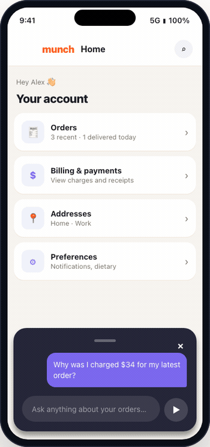

# MobileAI — React Native AI Agent

> **Autonomous AI agent for React Native** — Your app gets an AI copilot that can see, understand, and interact with your UI. Zero wrappers, zero view rewriting.

> If this helped you, consider giving it a ⭐ on [GitHub](https://github.com/mohamed2m2018/react-native-agentic-ai) — it helps others find this project!

<p align="center">
  
</p>

**Two names, one package — install either:**

| | Package | npm |
|---|---|---|
| 📦 | `@mobileai/react-native` | [](https://www.npmjs.com/package/@mobileai/react-native) |
| 📦 | `react-native-agentic-ai` | [](https://www.npmjs.com/package/react-native-agentic-ai) |

[](https://github.com/mohamed2m2018/mobileai-react-native/blob/main/LICENSE)
[]()

> Wrap your navigation with `<AIAgent>`. The AI reads your app's **rendered UI structure** automatically — every button, every input, every label — and acts on it by natural language. **Structure-first, not screenshot-first** — fast, accurate, and lightweight. Screenshots are used optionally to understand visual content like images and colors.

> **Use it as an AI Agent** (automates your UI), **an AI Assistant** (answers questions from a knowledge base), or both at once — one SDK, one prop.

## ✨ Features

### Text Mode
- 🤖 **Zero-config UI understanding** — No annotations needed. The AI reads your app's rendered UI structure automatically.
- 📐 **Structure-first** — Reads your UI structure directly. No OCR, no vision-only approach. Screenshots used optionally for visual content.
- 🎯 **Works with every component** — Buttons, switches, inputs, custom components — all work out of the box.
- 🖼️ **Sees images & videos** — The AI knows what media is on screen and can describe it.
- 🧭 **Auto-navigation** — Navigates between screens to complete multi-step tasks.
- 🧩 **Custom actions** — Expose any business logic (checkout, API calls) as AI-callable tools with `useAction`.
- 🌐 **MCP bridge** — Let external AI agents (OpenClaw, Claude Desktop) control your app remotely.
- 🧠 **Knowledge base** — Give the AI domain knowledge (policies, FAQs, product info) it can query on demand. Static array or bring your own retriever.
- 💡 **Knowledge-only mode** — Set `enableUIControl={false}` for a lightweight AI assistant with no UI interaction — single LLM call, ~70% fewer tokens.
- 🎙️ **Voice dictation** — Let users speak their request instead of typing. Automatically enabled if `expo-speech-recognition` is installed.


### 🎤 Voice Mode (Live Agent)
- 🗣️ **Real-time voice chat** — Bidirectional audio with Gemini Live API. Speak naturally, the agent responds with voice.
- 🤖 **Full UI control** — Same screen understanding, auto-navigation, and custom actions as Text Mode — all by voice.
- 🧠 **Knowledge base** — Voice agent can also query domain knowledge on demand.
- 🔄 **Screen change detection** — The agent automatically detects when the screen changes (e.g., loading finishes) and updates its context — no polling needed.
- 🚫 **Auto-navigation guard** — Code-level gate rejects tool calls before the user speaks, preventing the model from acting on screen context alone.

### Security & Production
- 🔒 **Production-grade security** — Element gating, content masking, lifecycle hooks, human-in-the-loop confirmation.

> **Provider support:** Currently supports **Google Gemini** only (`gemini-2.5-flash` for text, `gemini-2.5-flash-native-audio-preview` for voice). Additional providers may be added in future releases.

## 📦 Installation

```bash
npm install @mobileai/react-native
# — or —
npm install react-native-agentic-ai
```

No native modules required by default. Works with Expo managed workflow out of the box — **no eject needed**.

### Optional Native Dependencies

#### Screenshots

If you want to use **Screenshots** (for image/video content), install this optional peer dependency:

```bash
npx expo install react-native-view-shot
```

#### 🎤 Voice Mode (Real-time Voice Chat)

Voice mode enables real-time bidirectional audio with the Gemini Live API. It requires one native module:

```bash
# Audio capture + playback (required for voice mode):
npm install react-native-audio-api
```

**After installing, you need native configuration based on your setup:**

<details>
<summary><b>Expo Managed Workflow</b></summary>

Add permissions to your `app.json`:

```json
{
  "expo": {
    "android": {
      "permissions": [
        "RECORD_AUDIO",
        "MODIFY_AUDIO_SETTINGS"
      ]
    },
    "ios": {
      "infoPlist": {
        "NSMicrophoneUsageDescription": "Required for voice chat with AI assistant"
      }
    }
  }
}
```

Then rebuild: `npx expo prebuild && npx expo run:android` (or `run:ios`)

</details>

<details>
<summary><b>Expo Bare / React Native CLI</b></summary>

**Android** — add to `android/app/src/main/AndroidManifest.xml`:

```xml
<uses-permission android:name="android.permission.RECORD_AUDIO"/>
<uses-permission android:name="android.permission.MODIFY_AUDIO_SETTINGS"/>
```

**iOS** — add to `ios/YourApp/Info.plist`:

```xml
<key>NSMicrophoneUsageDescription</key>
<string>Required for voice chat with AI assistant</string>
```

Then rebuild: `npx react-native run-android` (or `run-ios`)

</details>

> **Note:** Hardware echo cancellation (AEC) is automatically enabled through `react-native-audio-api`'s AudioManager — no extra setup needed.

## 🚀 Quick Start

### React Navigation

```tsx
import { AIAgent } from '@mobileai/react-native';
import { NavigationContainer, useNavigationContainerRef } from '@react-navigation/native';

export default function App() {
  const navRef = useNavigationContainerRef();

  return (
    <AIAgent 
      // ⚠️ Prototyping ONLY: Do not ship API keys in your production app bundle!
      apiKey="YOUR_GEMINI_API_KEY" 
      
      // ✅ Production WAY: Route through your secure backend proxy
      // (See "Security & Production Setup" section below for detailed explanation)
      // proxyUrl="https://api.yourdomain.com/gemini-proxy"
      // proxyHeaders={{ Authorization: `Bearer ${userToken}` }}
      
      // 🔌 Optional: If you use Serverless for text, you can route Voice to a dedicated server
      // voiceProxyUrl="https://voice-server.render.com"
      
      navRef={navRef}
    >
      <NavigationContainer ref={navRef}>
        {/* Your existing screens — zero changes needed */}
      </NavigationContainer>
    </AIAgent>
  );
}
```

### Expo Router

In your root layout (`app/_layout.tsx`):

```tsx
import { AIAgent } from '@mobileai/react-native';
import { Slot, useNavigationContainerRef } from 'expo-router';
import type { KnowledgeEntry } from '@mobileai/react-native';

const KNOWLEDGE: KnowledgeEntry[] = [
  {
    id: 'returns',
    title: 'Return Policy',
    content: '30-day returns on all items. Electronics must be returned within 15 days.',
    tags: ['return', 'refund'],
  },
  // ... more entries
];

export default function RootLayout() {
  const navRef = useNavigationContainerRef();

  return (
    <AIAgent
      // ⚠️ Prototyping ONLY
      apiKey={process.env.EXPO_PUBLIC_GEMINI_API_KEY!}
      
      // ✅ Production WAY (See Security section below for detailed explanation)
      // proxyUrl="https://api.yourdomain.com/gemini-proxy"
      
      navRef={navRef}
      knowledgeBase={KNOWLEDGE}
    >
      <Slot />
    </AIAgent>
  );
}
```

A floating chat bar appears automatically. Ask the AI to navigate, tap buttons, fill forms — it reads your live UI and acts.

### Knowledge-Only Mode (No UI Automation)

Don't need UI automation? Set `enableUIControl={false}`. The AI becomes a lightweight FAQ / support assistant — no screen analysis, no multi-step agent loop, just question → answer:

```tsx
<AIAgent
  enableUIControl={false}
  knowledgeBase={KNOWLEDGE}
/>
```

**How it differs from full mode:**

| | Full mode (default) | Knowledge-only mode |
|---|---|---|
| UI tree analysis | ✅ Full fiber walk | ❌ Skipped |
| Screen content sent to LLM | ✅ ~500-2000 tokens | ❌ Only screen name |
| Screenshots | ✅ Optional | ❌ Skipped |
| Agent loop | Up to 10 steps | Single LLM call |
| Available tools | 7 (tap, type, navigate, ...) | 2 (done, query_knowledge) |
| System prompt | ~1,500 tokens | ~400 tokens |

The AI still knows the current **screen name** (from navigation state, zero cost), so `screens`-filtered knowledge entries work correctly. It just can't see what's *on* the screen — ideal for domain Q&A where answers come from knowledge, not UI.

## 🧠 Knowledge Base

Give the AI domain-specific knowledge it can query on demand — policies, FAQs, product details, etc. The AI uses a `query_knowledge` tool to fetch relevant entries only when needed (no token waste).


### Static Array (Simple)

Pass an array of entries — the SDK handles keyword-based retrieval internally:

```tsx
import type { KnowledgeEntry } from '@mobileai/react-native';

const KNOWLEDGE: KnowledgeEntry[] = [
  {
    id: 'shipping',
    title: 'Shipping Policy',
    content: 'Free shipping on orders over $75. Standard: 5-7 days ($4.99). Express: 2-3 days ($12.99).',
    tags: ['shipping', 'delivery', 'free shipping'],
  },
  {
    id: 'returns',
    title: 'Return Policy',
    content: '30-day returns on all items. Refunds processed in 5-7 business days.',
    tags: ['return', 'refund', 'exchange'],
    screens: ['product/[id]', 'order-history'], // optional: only surface on these screens
  },
];

<AIAgent knowledgeBase={KNOWLEDGE} />
```

### Custom Retriever (Advanced)

Bring your own retrieval logic — call an API, vector database, or any async source:

```tsx
<AIAgent
  knowledgeBase={{
    retrieve: async (query: string, screenName?: string) => {
      const results = await fetch(`/api/knowledge?q=${query}&screen=${screenName}`);
      return results.json();
    },
  }}
/>
```

The retriever receives the user's question and current screen name, and returns a formatted string with the relevant knowledge.


## 🔌 API Reference

### `<AIAgent>` Component

The root provider. Wrap your app once at the top level.

| Prop | Type | Default | Mode | Description |
|------|------|---------|------|-------------|
| `apiKey` | `string` | — | Both | Gemini API key (Prototypes only). |
| `proxyUrl` | `string` | — | Both | Secure backend proxy URL (For production). |
| `proxyHeaders` | `Record<string, string>` | — | Both | Optional headers for proxy (e.g. auth tokens). |
| `voiceProxyUrl` | `string` | — | Voice | Specific proxy URL for Voice Mode WebSockets. |
| `voiceProxyHeaders` | `Record<string, string>` | — | Voice | Specific headers for Voice Mode WebSockets. |
| `model` | `string` | `'gemini-2.5-flash'` | Text | Gemini model name. |
| `navRef` | `NavigationContainerRef` | — | Both | Navigation ref for auto-navigation. |
| `maxSteps` | `number` | `10` | Text | Max steps per task. |
| `showChatBar` | `boolean` | `true` | Both | Show the floating chat bar. |
| `enableVoice` | `boolean` | `true` | Voice | Enable voice mode tab in the chat bar. |
| `instructions` | `{ system?, getScreenInstructions? }` | — | Both | Custom system prompt and per-screen instructions. |
| `customTools` | `Record<string, ToolDefinition \| null>` | — | Both | Override or remove built-in tools. |
| `onResult` | `(result) => void` | — | Text | Called when the agent finishes a task. |
| `onBeforeStep` | `(stepCount) => void` | — | Text | Called before each agent step. |
| `onAfterStep` | `(history) => void` | — | Text | Called after each agent step. |
| `onTokenUsage` | `(usage) => void` | — | Text | Token usage callback per step. |
| `stepDelay` | `number` | — | Text | Delay between steps in ms. |
| `router` | `{ push, replace, back }` | — | Both | Expo Router instance. |
| `pathname` | `string` | — | Both | Current pathname (Expo Router). |
| `mcpServerUrl` | `string` | — | Text | WebSocket URL for MCP bridge. |
| `debug` | `boolean` | `false` | Both | Enable SDK debug logging. |
| `knowledgeBase` | `KnowledgeEntry[] \| KnowledgeRetriever` | — | Both | Domain knowledge the AI can query. See [Knowledge Base](#-knowledge-base). |
| `knowledgeMaxTokens` | `number` | `2000` | Both | Max token budget for knowledge retrieval results. |
| `enableUIControl` | `boolean` | `true` | Both | When `false`, disables UI tools (tap/type/navigate). AI becomes a knowledge-only assistant. |
| `accentColor` | `string` | — | Both | Quick accent color for the chat bar — tints the FAB, send button, and active states. |
| `theme` | `ChatBarTheme` | — | Both | Full color customization for the popup. See [Customization](#-customization). |

### 🎨 Customization

**Quick — one color:**
```tsx
<AIAgent accentColor="#6C5CE7" />
```

**Full theme control:**
```tsx
<AIAgent
  accentColor="#6C5CE7"
  theme={{
    backgroundColor: 'rgba(44, 30, 104, 0.95)',
    inputBackgroundColor: 'rgba(255, 255, 255, 0.12)',
    textColor: '#ffffff',
    successColor: 'rgba(40, 167, 69, 0.3)',
    errorColor: 'rgba(220, 53, 69, 0.3)',
  }}
/>
```

All fields are optional — only override what you need.

### `useAction(name, description, params, handler)`

Register a **non-UI action** the AI can call — for business logic that isn't a visible button.

```tsx
import { useAction } from '@mobileai/react-native';
// or: import { useAction } from 'react-native-agentic-ai';

function CartScreen() {
  const { cart, clearCart, getTotal } = useCart();

  // 'checkout' = tool name the AI calls, description = how the AI decides when to use it
  useAction('checkout', 'Place the order and checkout', {}, async () => {
    // Guard: return early with a failure message so the AI knows why
    if (cart.length === 0) {
      return { success: false, message: 'Cart is empty' };
    }
    const total = getTotal();

    // Human-in-the-loop: the AI's execution pauses here until the user taps Confirm/Cancel.
    // This is how you prevent the AI from performing critical actions without explicit approval.
    return new Promise((resolve) => {
      Alert.alert(
        'Confirm Order by AI',
        `Do you want the AI to place your order for $${total}?`,
        [
          { text: 'Cancel', style: 'cancel',
            onPress: () => resolve({ success: false, message: 'User denied the checkout.' }) },
          { text: 'Confirm', style: 'default',
            onPress: () => {
              clearCart();
              // Return success: true so the AI knows the action completed
              resolve({ success: true, message: `Order placed! Total: $${total}` });
            }
          },
        ]
      );
    });
  });
}
```

| Param | Type | Description |
|-------|------|-------------|
| `name` | `string` | Unique action name. |
| `description` | `string` | Natural language description for the AI. |
| `parameters` | `Record<string, string>` | Parameter schema (e.g., `{ itemName: 'string' }`). |
| `handler` | `(args) => any` | Execution handler. Can be sync or async. |

### Headless / Custom UI Integration (`useAI`)

Want to completely hide the default floating chat bar and build your own custom interface? 
The `useAI()` hook lets you tap directly into the agent's brain from anywhere inside the `<AIAgent>` tree.

```tsx
import { useAI } from '@mobileai/react-native';

function CustomChatScreen() {
  const { send, isLoading, status, messages, lastResult } = useAI();
  
  return (
    <View style={{ flex: 1 }}>
      <FlatList 
        data={messages} 
        renderItem={({ item }) => (
          <Text style={{ color: item.role === 'user' ? 'blue' : 'black' }}>
            {item.content}
          </Text>
        )} 
      />
      
      {isLoading && <Text>{status}</Text>}
      
      <TextInput 
        onSubmitEditing={(e) => send(e.nativeEvent.text)} 
        placeholder="Ask the AI..."
      />
    </View>
  );
}
```

**1. Global Chat Persistence**  
Because `messages` are managed globally by the root `<AIAgent>` provider, your chat history survives even if the user navigates away to a completely different tab and comes back!

**2. Dynamic Config Overrides**  
You can dynamically override global settings just for the specific screen calling the hook:

```tsx
const router = useRouter();

const { send } = useAI({
  // Force Knowledge-Only mode for tasks sent from this specific screen
  enableUIControl: false,
  
  // Custom routing: navigate back to this screen when the agent finishes
  onResult: (result) => {
    router.push('/(tabs)/chat');
  },
});
```

## 🔒 Security & Production Setup

### 1. API Key Protection (Backend Proxy)
> **Important:** It is highly recommended to avoid shipping the `apiKey` directly in your production app bundle. Since mobile app code can be extracted, keeping your keys on a backend server helps prevent unauthorized usage.

The safest architecture is to use a **Backend Proxy**.

**A. How to configure the SDK for production:**
```tsx
<AIAgent 
  proxyUrl="https://myapp.vercel.app/api/gemini" // Used for Text Mode
  proxyHeaders={{ Authorization: `Bearer ${userToken}` }}
  
  // (Optional) Serverless Hybrid Architecture:
  voiceProxyUrl="https://voice-server.render.com" // Used for Voice Mode WebSockets
  navRef={navRef}
>
```
> **Note on Hybrid Architectures:** If `voiceProxyUrl` isn't provided, it safely falls back to using `proxyUrl` for everything. You only need `voiceProxyUrl` if your main API is hosted on a Serverless environment (like Vercel) that terminates WebSockets, requiring you to host the voice socket on a dedicated platform.

**B. Next.js Route Handler Example (For Text Mode):**
```typescript
import { NextResponse } from 'next/server';

export async function POST(req: Request) {
  try {
    const body = await req.json();
    const REAL_API_KEY = process.env.GEMINI_API_KEY; // Secure on server
    
    const response = await fetch('https://generativelanguage.googleapis.com/...', {
      method: 'POST',
      headers: {
        'Content-Type': 'application/json',
        'x-goog-api-key': REAL_API_KEY!,
      },
      body: JSON.stringify(body),
    });

    return NextResponse.json(await response.json());
  } catch (error) {
    return NextResponse.json({ error: 'Proxy failed' }, { status: 500 });
  }
}
```

**C. Node.js Express WebSocket Proxy Example (For Voice/Live Mode):**
Voice mode uses `ai.live.connect()` which requires a persistent WebSocket connection. Standard Serverless functions do not support WebSockets. You need a long-running Node.js proxy using `http-proxy-middleware`.

```javascript
const express = require('express');
const { createProxyMiddleware } = require('http-proxy-middleware');

const app = express();
const REAL_API_KEY = process.env.GEMINI_API_KEY;

const geminiProxy = createProxyMiddleware({
  target: 'https://generativelanguage.googleapis.com',
  changeOrigin: true,
  ws: true, // IMPORTANT: Enables WebSocket proxying for Live Voice Agent
  pathRewrite: (path, req) => {
    // Inject the real API key into the secure backend connection
    const separator = path.includes('?') ? '&' : '?';
    return `${path}${separator}key=${REAL_API_KEY}`;
  }
});

app.use('/v1beta/models', geminiProxy);
const server = app.listen(3000);
server.on('upgrade', geminiProxy.upgrade);
```

### 2. Element Gating

Hide specific elements from the AI:

```tsx
// Per-element: add aiIgnore prop
<Pressable aiIgnore={true} onPress={handleAdmin}>
  <Text>Admin Panel</Text>
</Pressable>

// Per-ref: blacklist by reference
const secretRef = useRef(null);
<AIAgent interactiveBlacklist={[secretRef]}>
  <Pressable ref={secretRef}>Hidden from AI</Pressable>
</AIAgent>
```

### Content Masking

Sanitize sensitive data before the LLM sees it:

```tsx
<AIAgent
  transformScreenContent={(content) =>
    content.replace(/\b\d{13,16}\b/g, '****-****-****-****')
  }
/>
```

### Screen-Specific Instructions

Guide the AI's behavior on sensitive screens:

```tsx
<AIAgent
  instructions={{
    system: 'You are a food delivery assistant.',
    getScreenInstructions: (screenName) => {
      if (screenName === 'Cart') {
        return 'Always confirm the total with the user before checkout.';
      }
    },
  }}
/>
```

### Human-in-the-Loop

Force native confirmation before critical actions:

```tsx
useAction('checkout', 'Place the order', {}, () => {
  return new Promise((resolve) => {
    Alert.alert('Confirm?', 'Place this order?', [
      { text: 'Cancel', onPress: () => resolve({ success: false }) },
      { text: 'Yes', onPress: () => resolve({ success: true }) },
    ]);
  });
});
```

### Lifecycle Hooks

| Prop | Description |
|------|-------------|
| `onBeforeStep` | Called before each agent step. |
| `onAfterStep` | Called after each step with full history. |
| `onBeforeTask` | Called before task execution starts. |
| `onAfterTask` | Called after task completes. |

## 🌐 MCP Bridge (Control Your App from Desktop AI)

The MCP (Model Context Protocol) bridge lets **external AI agents** — like Claude Desktop, OpenClaw, or any MCP-compatible client — remotely control your React Native app through natural language.

### Architecture

```
┌──────────────────┐     SSE/HTTP      ┌──────────────────┐    WebSocket     ┌──────────────────┐
│  Claude Desktop  │ ◄──────────────► │   MCP Server     │ ◄─────────────► │  Your React      │
│  or any MCP      │    (port 3100)   │   (Node.js)      │   (port 3101)   │  Native App      │
│  compatible AI   │                  │                  │                 │                  │
└──────────────────┘                  └──────────────────┘                 └──────────────────┘
```

### How It Works

1. The **MCP server** (included in `mcp-server/`) runs on your machine as a Node.js process
2. Your **React Native app** connects to the server via WebSocket (`ws://localhost:3101`)
3. An **external AI** (e.g., Claude Desktop) connects to the MCP server via SSE (`http://localhost:3100/mcp/sse`)
4. When Claude sends a command like *"Order 2 lemonades"*, the MCP server forwards it to your app
5. Your app's `AgentRuntime` executes the task autonomously and sends back the result

### Setup

**1. Start the MCP server:**

```bash
cd mcp-server
npm install
npm start
```

This starts two servers:
- **HTTP/SSE** on `http://localhost:3100` — for AI clients (Claude, OpenClaw)
- **WebSocket** on `ws://localhost:3101` — for your React Native app

**2. Connect your app:**

```tsx
<AIAgent
  apiKey="YOUR_GEMINI_KEY"
  mcpServerUrl="ws://localhost:3101"
/>
```

**3. Connect Claude Desktop** — add this to your Claude config (`~/Library/Application Support/Claude/claude_desktop_config.json`):

```json
{
  "mcpServers": {
    "mobile-app": {
      "url": "http://localhost:3100/mcp/sse"
    }
  }
}
```

### Available MCP Tools

| Tool | Description |
|------|-------------|
| `execute_task(command)` | Send a natural language task to the app (e.g., *"Add a burger to cart"*) |
| `get_app_status()` | Check if the React Native app is currently connected |

### Environment Variables

| Variable | Default | Description |
|----------|---------|-------------|
| `MCP_PORT` | `3100` | HTTP/SSE port for AI clients |
| `WS_PORT` | `3101` | WebSocket port for the React Native app |

## 🛠️ Built-in Tools

| Tool | Description |
|------|-------------|
| `tap(index)` | Tap any interactive element. Works universally on buttons, switches, checkboxes, and custom components. |
| `type(index, text)` | Type text into a text-input. |
| `navigate(screen)` | Navigate to a screen. |
| `capture_screenshot(reason)` | Capture the current screen as an image. Called on-demand by the AI (requires `react-native-view-shot`). |
| `done(text)` | Complete the task with a response. |
| `ask_user(question)` | Ask the user for clarification. |
| `query_knowledge(question)` | Search the knowledge base. Only available when `knowledgeBase` is configured. |

## 📋 Requirements

- React Native 0.72+
- Expo SDK 49+ (or bare React Native)
- Gemini API key — [Get one free](https://aistudio.google.com/apikey)

## 📄 License

MIT © [Mohamed Salah](https://github.com/mohamed2m2018)

👋 Let's connect — [LinkedIn](https://www.linkedin.com/in/muhammad-salah-eldin/)
